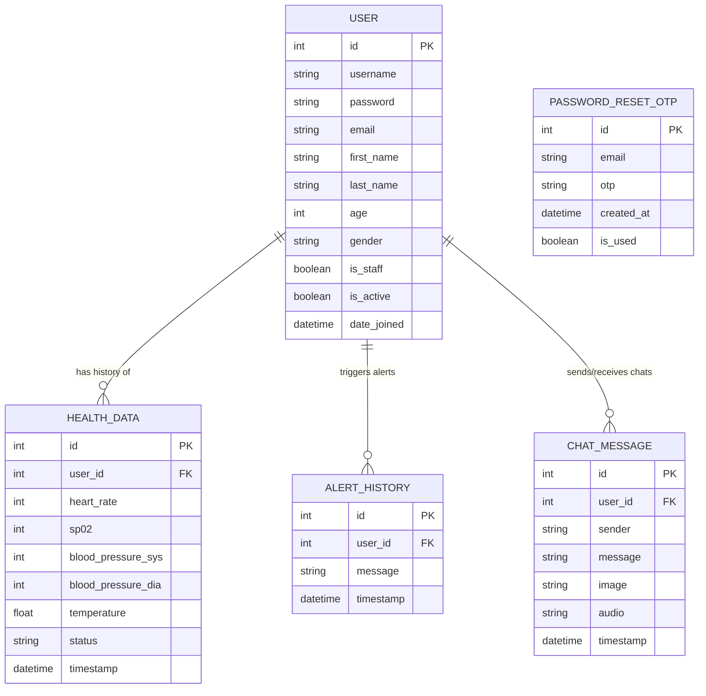

# 🗄️ CardioGo Database Schema

CardioGo uses a relational database schema managed via **Django ORM** (defaulting to SQLite for local development and compatible with PostgreSQL for production). Below is the detailed schema description, field types, validation rules, and the entity-relationship diagram.

---

## 📊 Entity Relationship Diagram

---

## 📝 Tables & Fields Specification

### 1. `User` (extends Django's AbstractUser)
Stores authentication details, profile configurations, and custom health metadata for patients.

| Field Name | Type | Constraints / Attributes | Description |
| :--- | :--- | :--- | :--- |
| `id` | Integer | Primary Key, Auto-increment | Unique identifier for each user account. |
| `username` | Varchar(150) | Unique, Required | The username used to log in. |
| `email` | Email | Unique, Required | The email address associated with the account. |
| `password` | Varchar(128) | Required | Hashed password string. |
| `age` | Integer | Nullable, Blankable | Age of the patient (used in AI chatbot analysis). |
| `gender` | Varchar(10) | Choices: `M` (Male), `F` (Female), `O` (Other), Nullable | Biological sex of the patient. |
| `is_staff` | Boolean | Default: `False` | True for doctor/admin users who can access the Doctor Dashboard. |
| `is_active` | Boolean | Default: `True` | Flag to activate/deactivate accounts. |
| `date_joined` | DateTime | Auto-filled | Timestamp when the user registered. |

### 2. `HealthData`
Stores individual vital sign entries uploaded by the mobile client (from manual logging or ESP32 hardware streaming).

| Field Name | Type | Constraints / Attributes | Description |
| :--- | :--- | :--- | :--- |
| `id` | Integer | Primary Key, Auto-increment | Unique record identifier. |
| `user_id` | Integer | ForeignKey (`User.id`), Cascade Delete | The patient whom this vital sign record belongs to. |
| `heart_rate` | Integer | Required | Heart rate in beats per minute (BPM). |
| `sp02` | Integer | Required | Oxygen saturation percentage (%). |
| `blood_pressure_sys` | Integer | Required | Systolic blood pressure (mmHg). |
| `blood_pressure_dia` | Integer | Required | Diastolic blood pressure (mmHg). |
| `temperature` | Float | Required | Body temperature in Celsius (°C). |
| `status` | Varchar(20) | Choices: `normal`, `warning`, `critical` | The triage status computed based on vital sign thresholds. |
| `timestamp` | DateTime | Auto-add on creation | Timestamp of when the record was recorded on the server. |

### 3. `AlertHistory`
Maintains a chronological record of warning/critical events triggered by patients, displayed prominently on the Doctor Dashboard.

| Field Name | Type | Constraints / Attributes | Description |
| :--- | :--- | :--- | :--- |
| `id` | Integer | Primary Key, Auto-increment | Unique alert ID. |
| `user_id` | Integer | ForeignKey (`User.id`), Cascade Delete | The user who triggered the critical threshold. |
| `message` | Varchar(255) | Required | A descriptive notification message detailing the abnormal vital readings. |
| `timestamp` | DateTime | Auto-add on creation | Timestamp when the alert was fired. |

### 4. `ChatMessage`
Maintains history of chats exchanged between patients and the CardioGo AI medical assistant. Can be synced offline-to-online.

| Field Name | Type | Constraints / Attributes | Description |
| :--- | :--- | :--- | :--- |
| `id` | Integer | Primary Key, Auto-increment | Unique message ID. |
| `user_id` | Integer | ForeignKey (`User.id`), Cascade Delete | The user who participated in this chat interaction. |
| `sender` | Varchar(10) | Choices: `user`, `ai` | Identifies who sent the message. |
| `message` | TextField | Nullable, Blankable | The text content of the message. |
| `image` | ImageFile | Nullable, Blankable, Uploads to `/chat_images/` | Optional diagnostic image attachment. |
| `audio` | File | Nullable, Blankable, Uploads to `/chat_audio/` | Optional voice message attachment. |
| `timestamp` | DateTime | Auto-add on creation | Time the chat was sent/received. |

### 5. `PasswordResetOTP`
Temporarily stores one-time passwords for password recovery workflows.

| Field Name | Type | Constraints / Attributes | Description |
| :--- | :--- | :--- | :--- |
| `id` | Integer | Primary Key, Auto-increment | Unique OTP ID. |
| `email` | Email | Required | The email address requesting the reset. |
| `otp` | Varchar(6) | Required | The generated 6-digit numeric OTP code. |
| `created_at` | DateTime | Auto-add on creation | Timestamp when OTP was generated (valid for 10 minutes). |
| `is_used` | Boolean | Default: `False` | Tracks if the OTP has already been redeemed. |
