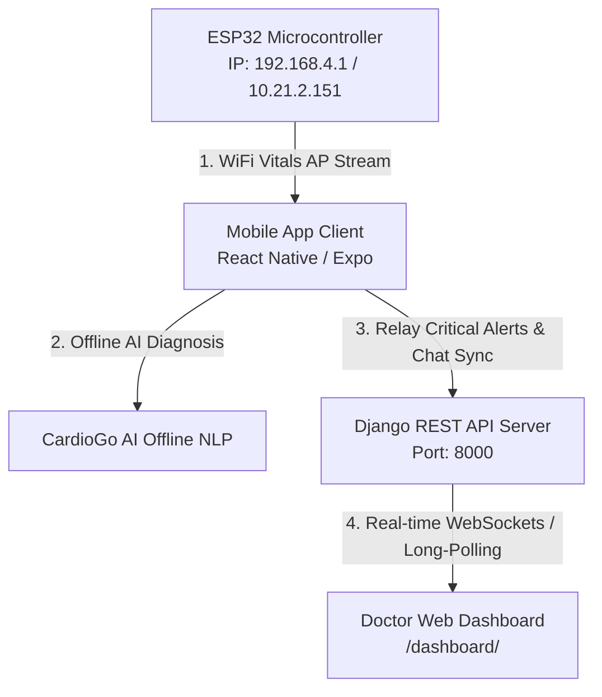

# 🫀 CardioGo: Remote Patient Vital Monitoring & AI Diagnostic System

CardioGo is a comprehensive, production-grade medical monitoring platform that integrates **ESP32 IoT hardware controllers**, a **Django REST API Backend Server**, a **React Native (Expo) Mobile Client**, and a glassmorphic **Doctor Portal Web Dashboard** to offer real-time health tracking and AI-driven clinical insights.

---

## 📐 System Architecture & Network Connections

To run CardioGo successfully, the ESP32 sensor hardware, your PC (Django Backend Server), and the Mobile smartphone must communicate seamlessly. Here is the network topology and flow of data:



### 📶 How the Devices Connect Together:

1. **ESP32 (Vitals Streamer)**: 
   * The ESP32 is loaded with the `esp32_wifi_vitals.ino` firmware.
   * It broadcasts its own Wi-Fi Access Point (SSID: `CardioGo-Vitals-Tracker`, default Gateway IP: `192.168.4.1` or configured local IP like `10.21.2.151`).
   * It serves raw sensor readings (Heart Rate and SpO2) on the `/vitals` endpoint in JSON format: `{"heart_rate": 72, "sp02": 98}`.

2. **Mobile Smartphone (The Router & Controller)**:
   * The mobile phone connects directly to the **ESP32 Wi-Fi network**.
   * The mobile client runs a fast polling loop to query the ESP32: `http://192.168.4.1/vitals` or `http://10.21.2.151/vitals`.
   * **Intelligent Auto-Saving**: If the vitals are normal, the app caches them locally. If a **warning** or **critical** risk status is predicted (e.g. Heart Rate < 60 or SpO2 < 95), the app automatically relays these vitals to the Django cloud server `http://<YOUR_PC_IP>:8000/api/health/data/` in the background, updating the Doctor Portal in real-time.
   * **AI Chat Synchronization**: The phone keeps chat history locally in AsyncStorage so patients can consult the AI even offline. Once a server connection is established, the mobile client uploads historical chats in the background using the `is_sync` protocol.

3. **PC / Local Cloud (Django Server & Doctor Portal)**:
   * The Django backend is running at `http://localhost:8000` or `http://0.0.0.0:8000`.
   * **Doctor Web Dashboard**: Access `/dashboard/` on any desktop web browser to monitor aggregate cohort statistics, patient chat logs, vital histories, and receive real-time audio-visual sirens for critical cases.

---

## 🚀 Execution & Setup Instructions

### 1. 🐍 Backend (Django Server) Setup
Navigate to the `backend/` directory:
```bash
cd backend
```
Install dependencies:
```bash
pip install -r requirements.txt
```
Run migrations and apply database schema:
```bash
python manage.py makemigrations health_app
python manage.py migrate
```
Start the backend server on all network interfaces (important for mobile-to-backend communication):
```bash
python manage.py runserver 0.0.0.0:8000
```
*   **Doctor Dashboard**: `http://localhost:8000/dashboard/`
*   **Default Admin Credentials**:
    *   **Username**: `admin`
    *   **Password**: `adminpassword123`

---

### 2. 📱 Mobile (React Native Expo) Setup
Navigate to the `mobile/` directory:
```bash
cd mobile
```
Install node modules:
```bash
npm install
```
Configure your server IP address inside `src/services/api.js`:
```javascript
const BASE_URL = 'http://<YOUR_PC_LOCAL_IP>:8000/api/';
```
Start the Expo Metro Bundler:
```bash
npx expo start
```
*   Scan the QR code with your iOS Camera or Android Expo Go app to launch!

---

### 3. 🔌 ESP32 Hardware Setup
Navigate to the `esp32_wifi_vitals/` directory:
* Open `esp32_wifi_vitals.ino` inside the **Arduino IDE**.
* Configure the Wi-Fi credentials or Access Point parameters if necessary.
* Wire the **MAX30102 pulse oximeter** (SDA -> GPIO21, SCL -> GPIO22, VCC -> 3.3V, GND -> GND).
* Wire the **Vibration Alert Motor** (Positive pin -> GPIO13, Negative pin -> GND).
* Select your ESP32 board, select the correct Port, and click **Upload**!

---

## 🛠️ Connection Troubleshooting Checklist

1. **Mobile can't reach Django Backend?**
   * Ensure your PC and Smartphone are connected to the **same Wi-Fi network** (unless the phone is on the ESP32 AP and syncing is deferred).
   * Do NOT use `localhost` in `api.js` inside the mobile code. You MUST use your PC's actual local IPv4 address (run `ipconfig` on Windows to find it).
   * Ensure Windows Defender or third-party firewalls are not blocking inbound traffic on Port `8000`.

2. **Mobile can't reach ESP32?**
   * Go to your phone's Wi-Fi Settings and make sure you are actively connected to the **ESP32 Wi-Fi network**.
   * Confirm the ESP32's IP address matches the IP address in your mobile's dashboard settings screen.