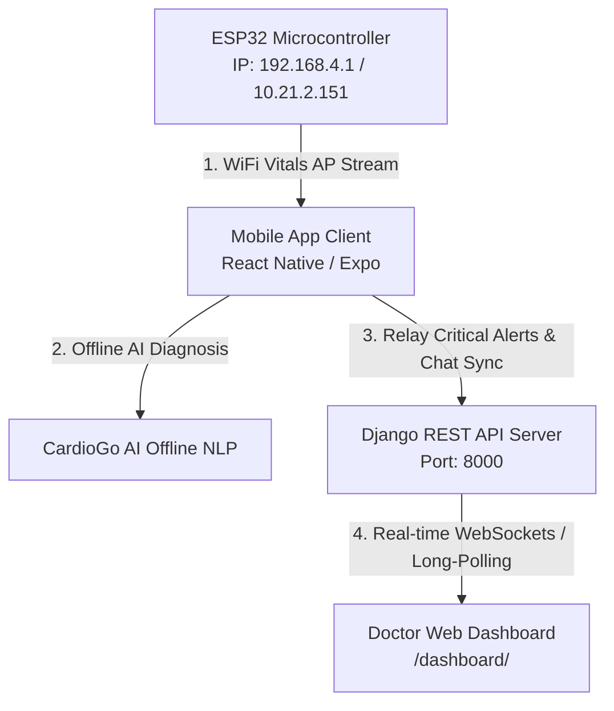

# 🫀 CardioGo: Remote Patient Vital Monitoring & AI Diagnostic System

<p align="center">
  
  
  
</p>

CardioGo is an end-to-end, medical-grade telemonitoring platform designed for remote patient vital tracking and AI-driven clinical diagnostics. Integrating **ESP32 IoT sensor hardware**, an **AI-optimized Django REST API Backend**, a **React Native (Expo) Mobile Patient App**, and a glassmorphic **Doctor Web Dashboard**, CardioGo ensures real-time health updates, automated high-risk detection, and seamless clinical cohort management.

---

## 👥 Team Members
| Name | ID | Program |
| :--- | :--- | :--- |
| **Abdalrahman Khaled** | 202201655 | DSAI |
| **Tasneem Ashraf** | 202201573 | DSAI |
| **Rihana Nasr** | 202201092 | DSAI |
| **Reem Ehab** | 202201373 | DSAI |

## 🎓 Supervisor
**Dr. Mohammed Maher**

---

## ⚠️ Problem Statement
Cardiovascular diseases (CVDs) remain the leading cause of global mortality. Key issues addressed by CardioGo include:
1. **Delayed Intervention:** Critical changes in vital signs (like sudden tachycardia or hypoxia) often go unnoticed until clinical complications arise.
2. **Telemetry Gaps:** Existing consumer wearables are isolated, expensive, and do not stream directly to treating physicians in real-time.
3. **Clinical Overload:** Doctors lack unified cohort dashboards that automatically triage and prioritize critical patients using machine learning models.
4. **Offline Barriers:** Standard telemetry apps depend entirely on constant active cloud connections, rendering diagnostic advice unavailable in connection-poor environments.

---

## ✨ Features
* **Real-time IoT Streaming:** Seamless telemetry from an ESP32 microcontroller tracking heart rate, SpO2, and temperature over local Wi-Fi.
* **On-Device Deep Learning Inference:** A client-side ONNX GRU sequence classifier predicting high-risk cardiac events from the last 15 frames of patient vitals.
* **Server-side CatBoost Triage:** A machine learning model analyzing individual vital records to categorize health status into `normal`, `warning`, or `critical`.
* **Empathetic AI Chatbot:** An LLM-powered chatbot providing personalized health insights based on the patient's immediate vitals, age, gender, and chat history.
* **Offline-First Synchronization:** Local AsyncStorage caching of vitals and chats that auto-syncs to the backend once connection is restored.
* **Glassmorphic Doctor Dashboard:** A web portal for medical professionals featuring cohort status analytics, real-time alert logs with audio-visual sirens, and direct access to patient details and histories.
* **Physical Haptic Alarm:** Vibration motors wired to the ESP32 trigger immediate physical alerts during hypoxic or tachycardic states.

---

## 📐 System Architecture

### Network & Telemetry Flow



### 📶 Network Integration Detail
1. **ESP32 (Vitals Streamer):** Operates as a Wi-Fi Access Point broadcasting `CardioGo-Vitals-Tracker`. Serves raw JSON data on `/vitals` at `192.168.4.1` (or local IP e.g. `10.21.2.151`).
2. **Mobile Client:** Pulls sensor readings from ESP32. Evaluates the GRU risk model locally. Auto-saves and relays abnormal records or background chats to the Django cloud backend.
3. **Django Cloud Server:** Receives and saves vitals, processes global CatBoost predictions, and updates the Doctor Portal via JSON endpoints.

---

## 🛠️ Technologies Used

### Frontend & Mobile
* **React Native (Expo):** Mobile app development.
* **React Native Chart Kit:** Real-time visual tracking of risk indices.
* **Expo AV & Haptics:** Audio-visual feedback and alerts.

### Backend & Dashboard
* **Django & Django REST Framework:** Web API development.
* **Django Templates & HTML5/CSS3:** Glassmorphic Doctor Web Dashboard.
* **Nginx:** Production-grade reverse proxy.

### Database
* **SQLite:** Default local database.
* **PostgreSQL:** Production-ready relational storage.

### AI & ML Frameworks
* **ONNX Runtime (Python & JS):** GRU deep learning sequence classifier.
* **CatBoost:** Decision-tree ensemble classifier for static records.
* **OpenAI API:** Advanced conversational LLM integration.

### DevOps & Infrastructure
* **Docker & Docker Compose:** Containerized orchestration.
* **GitHub Actions:** CI/CD verification flows.

---

## ⚙️ Setup Instructions

For details on the database structure, see [Database Schema](DATABASE_SCHEMA.md).  
For API specifications, see [API Documentation](API_DOCUMENTATION.md).

### 1. 🐍 Backend (Django Server) Setup
Navigate to the `backend/` directory:
```bash
cd backend
```
Install dependencies:
```bash
pip install -r requirements.txt
```
Run migrations and apply database schema:
```bash
python manage.py makemigrations health_app
python manage.py migrate
```
Create a superuser account for the dashboard access:
```bash
python manage.py createsuperuser
```
Start the backend server on all network interfaces:
```bash
python manage.py runserver 0.0.0.0:8000
```
* **Doctor Dashboard:** `http://localhost:8000/dashboard/`

### 2. 📱 Mobile (React Native Expo) Setup
Navigate to the `mobile/` directory:
```bash
cd mobile
```
Install node modules:
```bash
npm install
```
Configure your server IP address inside `src/services/api.js`:
```javascript
const BASE_URL = 'http://<YOUR_PC_LOCAL_IP>:8000/api/';
```
Start the Expo Metro Bundler:
```bash
npx expo start
```
* Scan the QR code using your iOS Camera or Android Expo Go app to launch.

### 3. 🔌 ESP32 Hardware Setup
Navigate to the `esp32_wifi_vitals/` directory:
* Open `esp32_wifi_vitals.ino` inside the **Arduino IDE**.
* Configure the Wi-Fi credentials or Access Point parameters if necessary.
* Wire the **MAX30102 pulse oximeter** (SDA -> GPIO21, SCL -> GPIO22, VCC -> 3.3V, GND -> GND).
* Wire the **Vibration Alert Motor** (Positive pin -> GPIO13, Negative pin -> GND).
* Select your ESP32 board, select the correct Port, and click **Upload**.

---

## 🚀 Deployment Instructions

### Docker Quickstart (Recommended)
You can deploy the complete backend and web dashboard using the containerized Docker stack. For full instructions, refer to the [Docker Deployment Guide](DOCKER.md).

1. Copy the environment variables:
   ```bash
   cp .env.example .env
   ```
2. Edit `.env` with your secure keys.
3. Build and launch:
   ```bash
   docker compose up --build -d
   ```
4. Access services:
   * **Dashboard:** `http://localhost/dashboard/`
   * **API Root:** `http://localhost/api/`

---

## 📖 Usage Guide
1. **Patient Registration:** Register on the mobile app, providing your age and gender.
2. **Vital Monitoring:** Connect to the ESP32 network to stream heart rate, SpO2, and temperature in real-time.
3. **AI Chatbot Interaction:** Tap the Chat icon to ask the AI assistant questions about health recommendations.
4. **Doctor Telemetry:** Doctors can log into the dashboard using admin credentials to view aggregated cohort charts and respond to real-time alerts.

---

## 📸 Screenshots / Demo
> Place your system screenshots and demo GIFs inside the `docs/screenshots/` folder.

1. **Mobile Application Dashboard:** Shows real-time GRU risk chart, live BPM, SpO2 tracker, and activity widgets.
2. **AI Health Chatbot:** Features conversational clinical tips tailored to patient vitals.
3. **Doctor Portal Cohort Triage:** Real-time web dashboard displaying alert notifications, active users, and patient vitals charts.